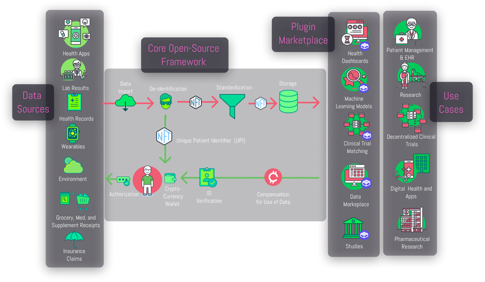
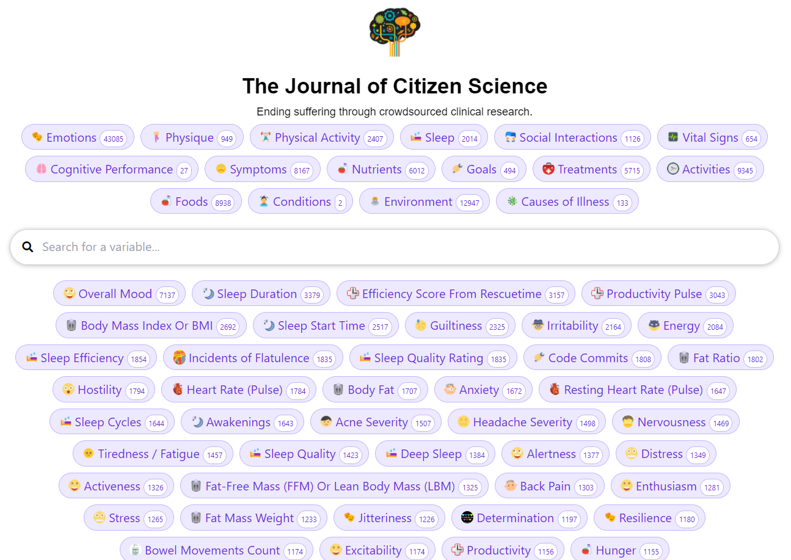

# The Personal FDA

The goal of this monorepo is to achieve maximum interoperability and minimum duplication of effort between the various projects in the digital health ecosystem.  

## Features

### 🏷 Outcome Labels

[More info about outcome labels](docs/features/outcome-labels/outcome-labels.md)

### Real-time Decision Support

[More info about real time decision support](docs/features/outcome-labels/outcome-labels.md)

### 📈 Predictor Search Engine

### Auto-Generated Observational Studies

[More info about observational studies](docs/features/observational-studies/observational-studies.md)

## Contribution Guide
- [Add an API](docs/contributing/add-an-api.md)
- [Repo Structure](docs/contributing/repo-structure.md)
- [Editing API Specifications](docs/contributing/editing-api-specs.md)
