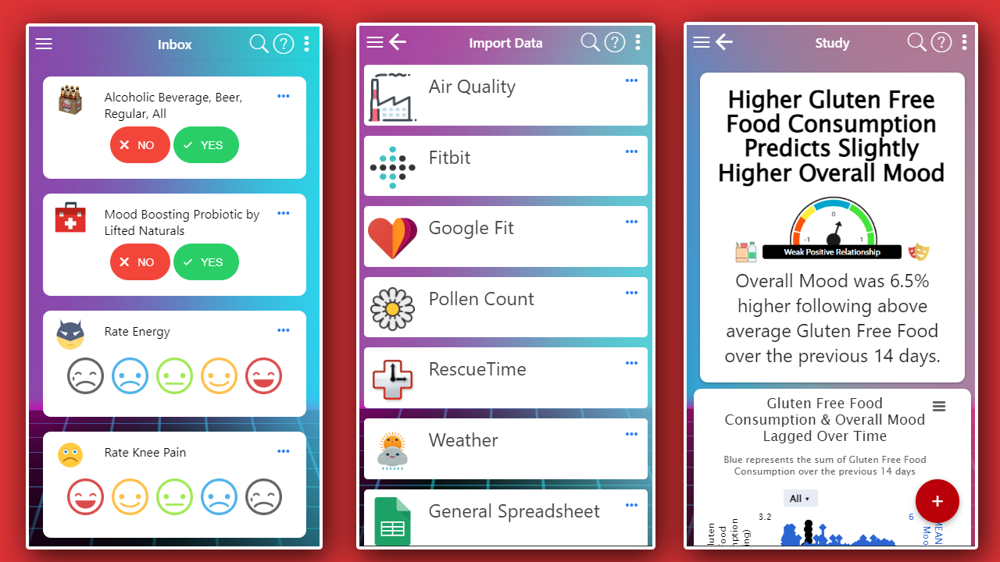
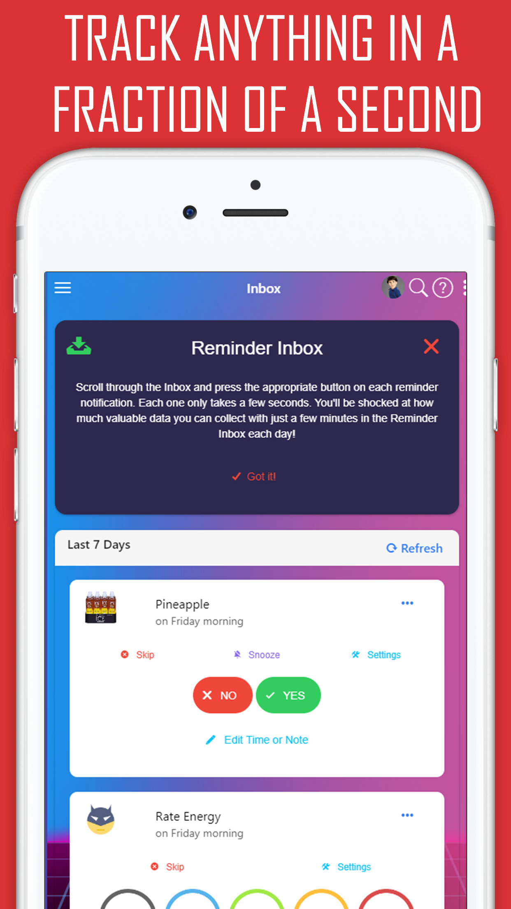

# The Decentralized FDA Mono-Repo

The goal of this monorepo is to achieve [maximum interoperability and minimum duplication of effort](https://curedao.org) between the various projects in the digital health ecosystem.


## Personal FDA

An app for collecting, aggregating, and analyzing health data to identify the most effective ways to optimize your health and happiness.

<details>
<summary>Table of Contents</summary>

- [Project Demo](#demo)
- [API](#api)
- [Features and Screenshots](#features-and-screenshots)
- [Local Development](#local-development)
- [Getting Involved](#get-involved)

</details>

## Features
* [🏷️Outcome Labels](#-outcome-labels)
* [🔮Predictor Search Engine](docs/features/predictor-search-engine/predictor-search-engine.md)
* [Root Cause Analysis](docs/features/root-cause-analysis-reports/root-cause-analysis-reports.md)
* [📜Observational Mega-Studies](https://www.curedao.org/blog/observational-studies-plugin)
* [Real-Time Decision Support Notifications](https://www.curedao.org/blog/optomitron) 
* [No Code Health App Builder](https://www.curedao.org/blog/no-code-health-app-builder)
* [AI Robot Doctor](https://www.curedao.org/blog/optomitron)
* [Chrome Extension](https://www.curedao.org/blog/chrome-extension)
<p align="center">


&nbsp
</p>
<p align="center">
  
  
</p>


### 🏷 Outcome Labels


[More info about outcome labels](docs/features/outcome-labels/outcome-labels.md)

### Real-time Decision Support


[More info about real time decision support](docs/features/outcome-labels/outcome-labels.md)

### 📈 Predictor Search Engine


### Auto-Generated Observational Studies


[More info about observational studies](docs/features/observational-studies/observational-studies.md)

## Demo

Try the [demo](https://app.curedao.org)

## API

For more info about the types of data you can store and get from the API, try out our
[Interactive API Explorer](https://curedao.readme.io) with the access token `demo`.

## Quick Start

1. Fork the project
2. Click the `Open in Gitpod` button below in YOUR forked repo.
3. Allow Gitpod to open port 5555.  It should then open the project in a new tab.

[](https://gitpod-referer.now.sh/api/gitpod-referer-redirect)

## Local Development

**Step 1**
🔧 Fork the project

**Step 2**
⏬ Clone your forked version

**Step 3**
See the README's in the [apps](apps) and [libs](libs) folders for instructions on how to install and run the various projects.

## Get Involved

[CONTRIBUTING](https://www.curedao.org/join-us)

# Using the API

_Application Programming Interface Specification_

The API facilitates storage and retrieval of any type of human generated data.

The API is documented in this [OpenAPI Specification](libs/dfda-api-spec/src/dfda-api-spec.openapi.yml).

It can be edited by:
1. downloading Stoplight Studio [here](https://stoplight.io/studio/)
2. opening this repo folder as a local project

## API Usage

Interactive API documentation is available at https://curedao.readme.io.  However, we have some examples below.

### Get Commonly Used Variables, Units, and Variable Categories

You can include the scripts in `data` folder following scripts in your HTML to get the commonly used variables, units, and variable categories.

```javascript
<script src="https://static.quantimo.do/data/variables.js"></script>
<script src="https://static.quantimo.do/data/units.js"></script>
<script src="https://static.quantimo.do/data/variableCategories.js"></script>
```

Then they'll be available in:
- Variable Categories: `qm.staticData.variableCategories`
- Units: `qm.staticData.units`
- Variables: `qm.staticData.commonVariables`

### Less Common Variables

There are over 87,000 additional variables accessible via the following API endpoint:

https://curedao.readme.io/reference/getvariables

```javascript
const options = {
  method: 'GET',
  headers: {Accept: 'application/json', Authorization: 'Bearer demo'}
};

fetch('https://app.quantimo.do/api/v3/variables?limit=100', options)
  .then(response => response.json())
  .then(response => console.log(response))
  .catch(err => console.error(err));
```


## Getting Started

### Authentication

To use the CureDAO API, you first need to get an access token as described below.  Once you have the token, include it in any of the [API requests documented here](https://curedao.org/api-docs) using the `Authorization` header in the format `Bearer YOUR_TOKEN_HERE`.

#### Option 1: Use Demo Data
If you don't have your own data yet, you can use the access token `demo` in the `Authorization` header in the format `Bearer demo`.

#### Option 2: Access Your Own Data
- Go to the [Settings](https://app.curedao.org/#/app/settings)
- Click copy your Personal Access Token
- Include it in your [API requests](https://curedao.org/api-docs) using the `Authorization` header in the format `Bearer YOUR_TOKEN_HERE`

#### Option 3: Use it in Your Own App
- Go to the [App Builder](https://builder.curedao.org/#/app/configuration)
- Click `New App` and fill out the form
- Follow the OAuth integration instructions in the `Integration Guide` link

### Common API Usage Examples
Instead of using this SDK, you can also use the requests in our [interactive API documentation](https://curedao.org/api-docs).  Just click the dots to the right of the "LANGUAGE" section and select `Node` or `Javascript`.  Then you can just copy the request for usage in your project.

Here are some common usages:
- [Get Units](https://curedao.readme.io/reference/getunits)
- [Get Variables](https://curedao.readme.io/reference/getvariables)
- [Get Variable Categories](https://curedao.readme.io/reference/getvariablecategories)
- [Get a Specific Variable](https://curedao.readme.io/reference/getvariables)
- [Save a Measurement](https://curedao.readme.io/reference/postmeasurements)
- [Get Measurements](https://curedao.readme.io/reference/getmeasurements)

### [Get Variables](https://curedao.readme.io/reference/getvariables)


### [Get a Specific Variable](https://curedao.readme.io/reference/getvariables)


### [Save a Measurement](https://curedao.readme.io/reference/postmeasurements)


### [Get Measurements](https://curedao.readme.io/reference/getmeasurements)


# Contribution Guide
- [Add an API](docs/contributing/add-an-api.md)
- [Repo Structure](docs/contributing/repo-structure.md)
- [Editing API Specifications](docs/contributing/editing-api-specs.md)
