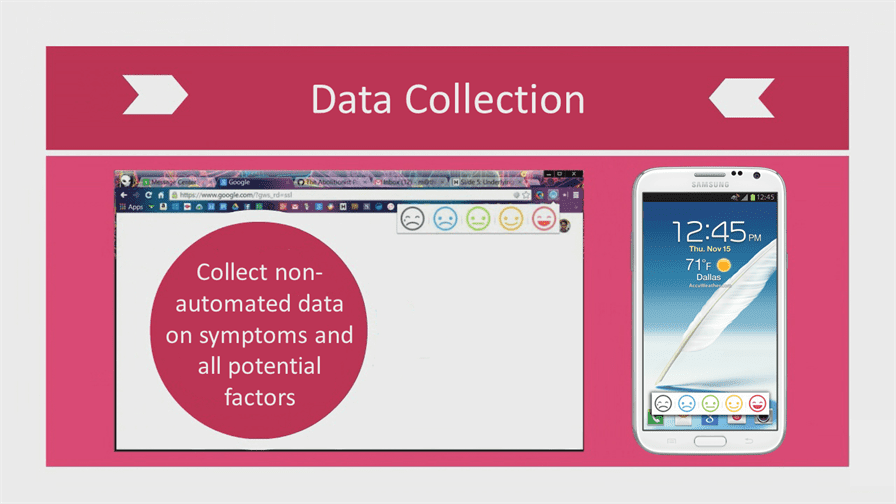

# 📲 Data Collection Plugins

It all begins with self-tracking and initial data collection.\
This can be done using wearable sensors, third-party applications, and client applications.

### Data Types

Ultimately, the system should be able to handle the following data types:

* Omics data (e.g., genomics, proteomics, metabolomics, etc.)
* Image and physiological data (e.g., CT, PET/SPECT, sMRI, fMRI, rMRI, DTI, EEG, MEG, ultrasound, cellular level imaging, multi-electrode recording, etc.)
* Clinical data (e.g., lab tests, pathology, imaging, diagnosis, electronic health records, etc.)
* Multiscale data (genomic, epigenomic, subcellular, cellular, network, organ, systems, organism, population levels)
* Multiplatform data (desktop, cloud-based storage, etc.)
* Data from multiple research areas and diseases (e.g., common inflammatory pathways in cancer, obesity, immune diseases, and neurodegenerative diseases)
* Data with special considerations (e.g., sparse data, heterogeneous data, very large or very small datasets)
* Human-computer interfaces and visualization

### Automated Data Acquisition

At the present time, it requires a great deal of effort and diligence on the part of the self-tracker to gather all of the data required to identify the triggers of mental illness and quantify the effectiveness of different treatments. Tracking one’s mood, diet, sleep, activity, and medication intake can be extremely time-consuming. The present invention automatically pulls data from a number of data sources (adding more all the time).

The data sources would include:

* Biometric Devices: that could measure vital signs and biomarkers
* Purchase Records: Data regarding consumption of foods and supplements could be automatically collected by and inferred from receipts or other financial aggregation services like Mint.com.
* Auditory Records: Voice recognition may be used to quantify emotion through conscious verbal expression, spectral analysis of the magnitudes of different frequencies of speech would probably be a better means of quantifying unconscious human affect and thus providing more accurate data for the machine learning process. CommonSense is a cloud-based platform for sensor data.
* Visual Affect Data via Web-Cameras: By tracking hundreds of points on the subjects’ faces, InSight can accurately capture emotional states.
* Prescription Records: Microsoft HealthVault can automatically collect lab results, prescription history, and visit records from a growing list of labs, pharmacies, hospitals, and clinics.

 (2).PNG>)
