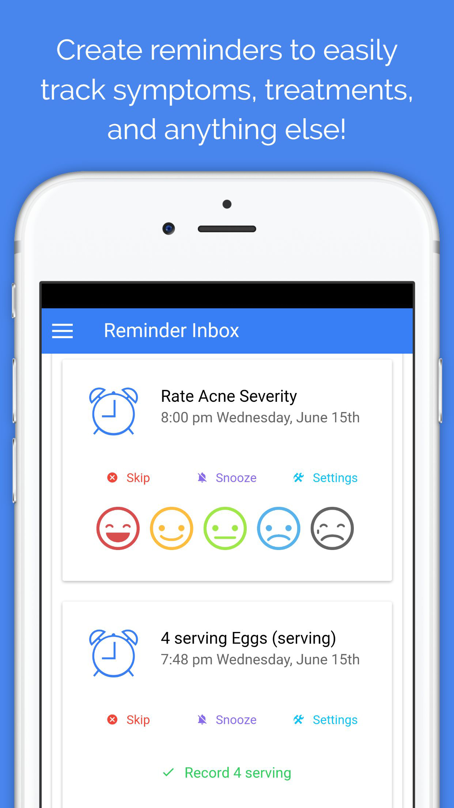
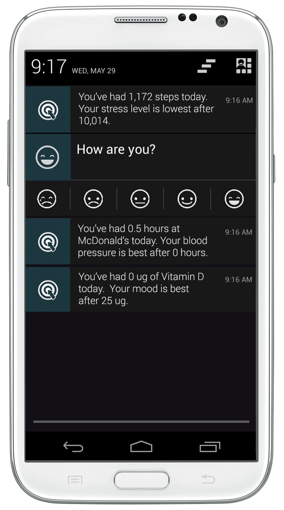

<!-- PROJECT TITLE -->
<h1 align="center">CuRoBoT</h1>

An app for collecting, aggregating, and analyzing health data to identify the most effective ways to optimize your health and happiness. 

<details>
<summary>Table of Contents</summary>

- [Project Demo](#demo)
- [API](#api)
- [Features and Screenshots](#features-and-screenshots)
- [Technology Stack](#technology-stack)
- [Local Development](#local-development)
- [Getting Involved](#get-involved)
- [License](#license)

</details>

## Demo

Try the [demo](https://app.curedao.org)

## API

For more info about the types of data you can store and get from the API, try out our
[Interactive API Explorer](https://curedao.readme.io) with the access token `demo`.

## Quick Start

1. Fork the project
2. Click the `Open in Gitpod` button below in YOUR forked repo.
3. Allow Gitpod to open port 5555.  It should then open the project in a new tab. 

[](https://gitpod-referer.now.sh/api/gitpod-referer-redirect)

## Local Development

**Step 1** 
:wrench: Fork the project

**Step 2**
:octocat: Clone your forked version

```bash
$ git clone https://github.com/your_username/curobot.git
```

**Step 3**
:hammer: Install [Node.js](http://nodejs.org/).  (Windows Developers: We recommend [Visual Studio Code](https://code.visualstudio.com/) with the [recommended extensions](.vscode/extensions.json), which automatically installs everything you need!)

**Step 5**
 :running: Run `npm install -g bower` and `bower install` in the root of this repository.

**Step 6**
:ticket: Create your application and get your client ID [here](https://builder.quantimo.do).

**Step 7** -
Make a copy of .env.example in the root called .env and add your client id to it

**Step 8** -
If you're using VSCode or Gitpod, right click on src/index.html and click "Open with FiveServer"

**Step 9**
 :raising_hand: Need help?  Please [create an issue](/issues) or [contact us](http://help.quantimo.do)
 
 ## Features and Screenshots

<p align="center">

&nbsp

<br><br>

&nbsp

<br><br>


</p>

## Technology Stack

| Technology | Description                       |
|------------|-----------------------------------|
| JavaScript | High-Level Programming Language   |
| TypeScript | JavaScript with syntax for types  |
| CSS        | Cascading Style Sheets            |
| SCSS       | Syntactically Awesome Style Sheet |
| Angular.js | front-end web framework           |
| HTML       | HyperText Markup Language         |
| Cypress    | standard in front-end testing     |
| Gitpod     | platform for remote development   |

## Get Involved

[CONTRIBUTING](https://www.curedao.org/join-us)

## License

[](https://github.com/cure-dao/curobot/blob/develop/LICENSE.md)
