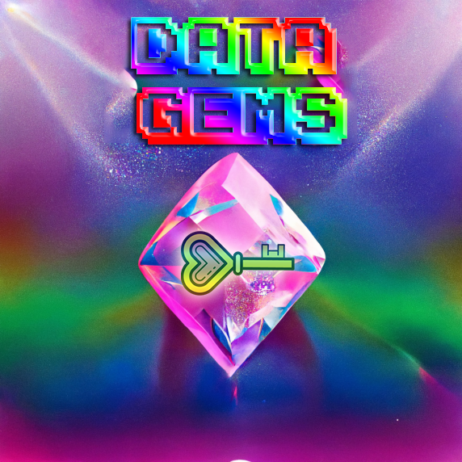

# Data Gems

Data Gems bestow their holder with magical powers enabling them to transcend the physical world and see an aspect of its inter-dimensionally linked digital twin. 

A more boring way to put it, is to say that Data Gems are NFT tokens that give the holder the ability to decrypt a data stream.

They can be mined by the data owner and can be given or sold to other Analog Twins or businesses.

## Initial DataGem MetaData

If you set `base_uri` now, the collection will be revealed immediately upon deployment. If you want to reveal the collection later, do the following:

Before deployment, upload the placeholder image to IPFS using `Upload a file to IPFS`.

1. Before deployment, upload a single placeholder metadata JSON using 
2. Upload metadata to IPFS, using the IPFS image URL you just uploaded as file_url.
3. When deploying, keep the `base_uri` empty and set `prereveal_token_uri` to the URL of the metadata file you just uploaded to IPFS.
4. When you are ready to reveal your collection, use `Update a deployed collection contract` to set the `base_uri` to the location of the IPFS metadata directory created in Step 2.

# Exchange Fees

The DeSci Exchange fees are set to 0.5% by default. You can change this by updating the contract. This fee is transferred 
to the [DeSci Exchange Gnosis Safe Multi-sig wallet](https://gnosis-safe.io/app/matic:0x98585BDfC013e00498c23d18D8E7b3A84A7Ad80f/home) that is set as the owner of the contract.

- **chain** - `polygon`
- **name** - `Digital Twin Data Gem`
- **symbol** - `DGEM` is the symbol of the NFT contract. Cannot be changed later.
- **max_supply** - `5000` is maximum number of NFTs that can be minted in this collection. Cannot be changed later.

### team_reserve = `0`

The number of NFTs that can only be minted by the contract owner for free. The team_reserve is part of max_supply and cannot be changed later.

integer >= 0 (Default: 0)

### mint_price = `0.1` (in MATIC)

Minting price per NFT, in units of the chain's native token.

### presale_mint_price = `0.1` (in MATIC)

Minting price per NFT in the presale phase, in units of the chain's native token.

### tokens_per_mint = `1`

The maximum number of NFTs a user can mint in a single transaction. Cannot be changed later.

### owner_address
string | required

The contract owner address. If you wish to own the contract, then set it as your wallet address. This is also the wallet that can manage the contract on NFT marketplaces. Use transferOwnership() to update the contract owner.

### treasury_address = `0x98585BDfC013e00498c23d18D8E7b3A84A7Ad80f`

string | required

The treasury address: the balance of paid minting prices can be withdrawn to this address. Call withdrawFees() (on a block explorer like Polygonscan) in the contract ABI to transfer the entire balance to the treasury address. Cannot be changed later.

### public_mint_start_date
string | required
Public minting start date (ISO). Eg: 2022-02-08T11:30:48+00:00.

### metadata_updatable
boolean
Default is true. If true, metadata of the NFTs minted in the specified contract can be updated after minting (token URIs are not frozen on the contract level). This is useful for creating dynamic NFTs or revealing the NFTs after the drop. If false, metadata of NFTs minted in this contract are frozen, which means base_uri cannot be updated..

### base_uri
string

Metadata base URI for tokens. If you specify this, then the metadata location of NFTs minted in this contract will be of the format base_uri + token_id. This is useful for creating dynamic NFTs or revealing the NFTs after the drop.

- prereveal_token_uri
string
Pre-reveal token URI for placeholder metadata. This will be returned for all token IDs until a baseURI has been set.

### presale_mint_start_date
string
Whitelisted/presale minting start date (ISO). Eg: 2022-02-08T11:30:48+00:00.

### presale_whitelisted_addresses
 - array[string]
 - List of addresses whitelisted for the presale. Maximum amount of addresses supported is 4000.

### royalties_share
integer between 0 and 10000
Secondary market royalty rate in basis points (100 bps = 1%). This value cannot exceed 10,000 bps.

### royalties_address
string
Address that will have access to the balance of royalties paid. Defaults to owner_address if not set.

# Withdraw balance from the contract to the treasury (optional)

Note: The minting price paid by the user will be transferred to the balance and can be withdrawn to the treasury_address at any time. To do this, you have to call the contract ABI. See function below:

// To withdraw minting fees to the treasury address
// @dev Callable by admin (owner) roles only
function withdrawFees() external onlyRole(ADMIN_ROLE) {
    _deploymentConfig.treasuryAddress.sendValue(address(this).balance);
}
This can be done very easily using a block explorer like Polygonscan (for Polygon) or Etherscan (for Rinkeby).

Note: This operation can only be done by the owner wallet.

a) Go to your contract page on Polygonscan (enter your contract address in the search). Now, go to the Contract section at the bottom and select Write Contract.

# Metadata Properties

### image

This is the URL to the image of the item. Can be just about any type of image (including SVGs, which will be cached into PNGs by OpenSea), and can be IPFS URLs or paths. We recommend using a 350 x 350 image.

### image_data

Raw SVG image data, if you want to generate images on the fly (not recommended). Only use this if you're not including the image parameter.

### external_url

This is the URL that will appear below the asset's image on OpenSea and will allow users to leave OpenSea and view the item on your site.

### description

A human-readable description of the item. Markdown is supported.

### name

Name of the item.

### attributes

These are the attributes for the item, which will show up on the OpenSea page for the item. (see below)

### background_color

Background color of the item on OpenSea. Must be a six-character hexadecimal without a pre-pended #.

### animation_url

A URL to a multi-media attachment for the item. The file extensions GLTF, GLB, WEBM, MP4, M4V, OGV, and OGG are supported, along with the audio-only extensions MP3, WAV, and OGA.

Animation_url also supports HTML pages, allowing you to build rich experiences and interactive NFTs using JavaScript canvas, WebGL, and more. Scripts and relative paths within the HTML page are now supported. However, access to browser extensions is not supported.

### youtube_url

A URL to a YouTube video.
