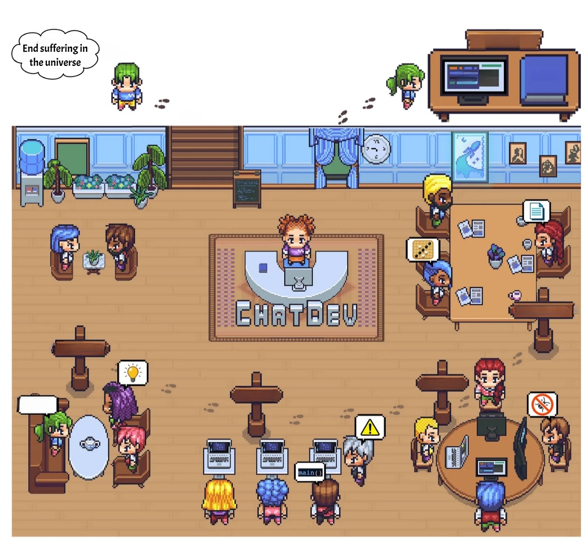
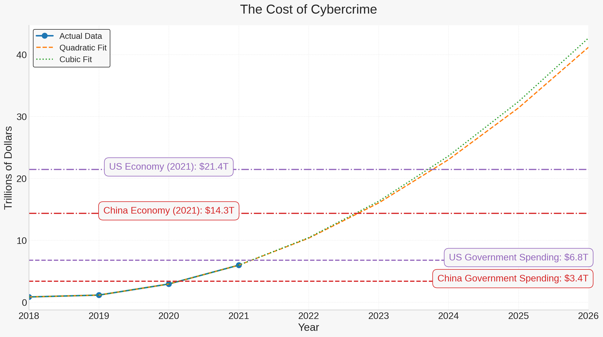
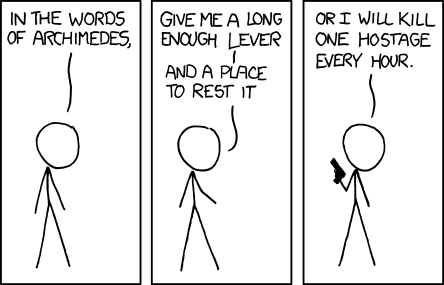
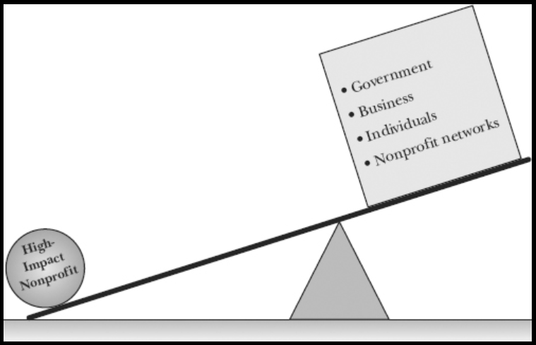
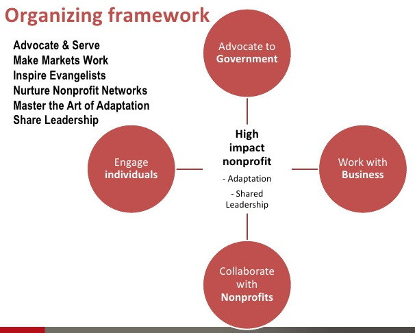
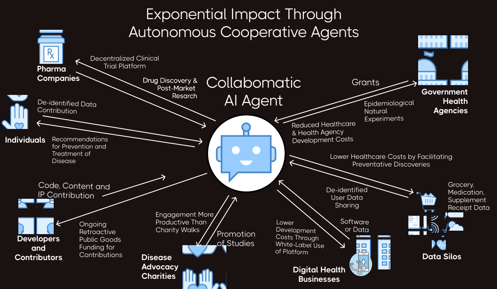

# Positron: Agents for Good

_An Autonomous Agent Framework to Maximize Public Goods_

## Overview

Non-profits are constrained by limited cognitive bandwidth and resources to achieve their mission. The highest leverage thing we can do at this point is to make it as easy as possible for these organizations to operationalize autonomous agents.

## Current Limitations

Current state-of-the-art AI models do not have the reasoning capabilities and context length required to autonomously advance the missions of nonprofits. However, these capabilities are rapidly evolving, and we can expect to see significant advancements in the next few years.

It would be very valuable for pro-social entities to have a framework that enables them to easily operationalize autonomous agents as soon as the technology is ready. 

## Isn't This Dangerous?

Regardless of what we do, cybercriminals and authoritarian governments will continue to use AI for antisocial purposes.  The only thing we can do is attempt to shift the balance of power in favor of pro-social entities.

Anti-social entities like cybercriminal organizations are already using AI to automate their operations and maximize their impact. Even without autonomous agents, parasitic cybercriminals are extracting more and more value from the productive economy which makes pro-social non-profits possible.  The cost of cybercrime is projected to reach [$10.5 trillion annually by 2025](https://www.forbes.com/sites/forbestechcouncil/2023/02/22/105-trillion-reasons-why-we-need-a-united-response-to-cyber-risk/?sh=aa441d13b0c4), which is more than the GDP of any country except the US and China.

If the exponential trend continues, the parasite could kill its host by extracting more value than the host can produce. Governments currently apprehend a tiny percentage of cybercriminals, so it's unlikely that they will be able to stop this trend. 

Governments are [spending billions](https://www.marketsandmarkets.com/Market-Reports/artificial-intelligence-military-market-41793495.html) on "slaughter bots" and other autonomous weapons as well as [mass surveillance](https://www.wired.com/story/ai-surveillance-cameras-europe/).  

### Tilting the Balance of Power to a Positive Future

#### Primary Objective Functions

More than changing human trajectories, super-intelligence is likely to amplify existing trends by optimizing for the primary objective functions of existing entities.
Although people have myriad motivations, there is generally a primary objective function that is most characteristic of each group.

1. **Criminals** - Drain maximum resources from the cooperative productive economy.  AI is perfectly suited for cybercrime and will allow cybercriminals to effectively clone themselves a million times over. 
2. **Politicians** - Maximize power.  Obviously, there are wonderful people with wonderful intentions in government.  However, decency can be a major disadvantage in politics.  The dark triad traits, which include Machiavellianism, psychopathy, and narcissism, have been found to be [far more predictive](https://www.frontiersin.org/articles/10.3389/fpos.2021.657750/full) of political power attainment.
3. **Corporations** - Maximize profits. This can be good in the sense that it incentivizes the creation of products and services that people want.  However, the most profitable thing a company can do is get government subsidies. ROI of corporate lobbying can be as high as [22,000%](https://www.freshonomics.org/blog/2021/3/14/the-logic-of-lobbying-how-do-you-turn-58-billion-into-44-trillion) compared to free market profit margins around [10%](https://www.capterra.com/resources/what-is-good-profit-margin-for-small-business/). 
4. **Nonprofits** - **Maximize global health and happiness** (in a very general sense on average). 

So only one of these entities has a primary objective function that is aligned with the interests of humanity as a whole.  Unfortunately, the non-profit sector isn't generally known for its efficiency.

### AI Arms Race Conditions

There's not much we can do to reduce autonomous AI adoption by cybercriminals and authoritarian governments and the inevitable harm that results. So despite the risks associated with autonomous agents, it's critical that we weight humanity's trajectory in favor of the most positive objective functions.

## Maximizing Leverage for Good

In a word, what separates effective non-profits from ineffective ones is leverage.

The highest leverage thing anyone can do at this point is to make it as easy as possible for pro-social entities to accelerate their mission through autonomous agents.

## Framework Design

To design an autonomous agent framework for nonprofits, we can leverage the principles outlined in the book [_Forces for Good_](https://www.google.com/books/edition/Forces_for_Good/OvlH81q2cBQC?hl=en&gbpv=1&printsec=frontcover) by Leslie Crutchfield and Heather McLeod Grant. 

The framework should enable nonprofits to effectively work with government, tap into the power of free markets, nurture nonprofit networks, build movements of evangelists, share leadership internally, and adapt quickly to changing conditions.

[Source: Forces for Good
The Six Practices of High-Impact Nonprofits](https://www.google.com/books/edition/Forces_for_Good/OvlH81q2cBQC?hl=en&gbpv=1&printsec=frontcover)

# Types of Agents

[ChatDev](https://github.com/OpenBMB/ChatDev)

The autonomous agent framework should facilitate the following functionalities:

1. **Advocacy and Research Agent**: Autonomous agents can be programmed to monitor and analyze government policies and market trends relevant to the nonprofit's mission. They can provide summaries and insights to guide the nonprofit's advocacy efforts.

2. **Market Engagement Agent**: Agents can identify potential business partnerships, sustainable business practices, and opportunities for earned income. They can facilitate interactions with businesses to promote mutually beneficial collaborations.

3. **Community Engagement Agent**: Autonomous agents can help in nurturing nonprofit networks by identifying potential partners, events, and collaborative opportunities within the local community.

4. **Movement Building Agent**: Agents can be designed to engage and mobilize volunteers and supporters, disseminate information, and facilitate community involvement to build movements of evangelists for the nonprofit's cause.

5. **Adaptation and Leadership Agent**: The framework should support adaptive decision-making and leadership sharing within the nonprofit, enabling quick responses to changing conditions and effective internal collaboration.

## FDAi-Specific Autonomous Agent Framework

Applying these principles specifically to the FDAi framework would entail the following elements and functions:

1. **Serve Individuals and Advocate on Their Behalf:**
  - **Data Collection and Analysis Module:** This module helps individuals collect and analyze personal data to uncover factors affecting their health, especially in areas like dementia or mental illness. It uses AI to identify patterns and risk factors from the collected data.
  - **Policy Advocacy Interface:** Interfaces with government portals to submit policy change requests and resource allocation proposals based on the data analysis.

2. **Make Markets Work:**
  - **Market Integration Module:** Develops partnerships with businesses (like pharmacies, online grocers, healthcare providers) for data exchange and service provision. It should have capabilities to analyze market trends and suggest potential partnerships or business models, like software development or data analysis services.
  - **Business Collaboration Toolkit:** Facilitates collaboration with businesses, aligning nonprofit goals with corporate social responsibility initiatives.

1. **Inspire Evangelists:**
  - **Community Engagement Engine:** This part of the framework manages volunteer databases, rewarding citizen scientists and researchers. It uses gamification strategies to engage users, tracking and rewarding contributions.
  - **Evangelist Development Program:** Develops training modules and engagement strategies to convert supporters into active evangelists.

4. **Building Non-Profit Networks:**
  - **Open Source Software Development Kit:** Provides tools and templates for other nonprofits to use in data collection and analysis.
  - **Affiliate Network Coordinator:** Manages and supports local affiliate groups, fostering collaboration among patients, physicians, researchers, data scientists, and programmers.

5. **Master the Art of Adaptation:**
  - **Adaptive Learning System:** Continuously analyzes the effectiveness of various strategies and adapts them based on feedback and changing circumstances. It learns from successes and failures to refine approaches.
  - **Innovation Lab:** A virtual space for testing new ideas and methodologies, allowing for controlled experimentation.

6. **Share Leadership:**
  - **Distributed Leadership Platform:** Distributes decision-making powers across the organization and network. Includes tools for collaboration, consensus-building, and conflict resolution.
  - **Leadership Development Module:** Focuses on building leadership skills throughout the organization, including training programs for upcoming leaders and boards.

## Framework Requirements

The framework should be designed to be user-friendly, customizable, and scalable to accommodate the diverse needs and capacities of nonprofits, including smaller, locally focused organizations with modest budgets. It should also prioritize security, privacy, and ethical considerations in handling sensitive data and interactions with external entities.

By integrating these principles into an autonomous agent framework, nonprofits can enhance their capacity to drive positive change and maximize their impact.

# Possible Foundational Frameworks

Open-source autonomous agent frameworks are revolutionizing the way we interact with artificial intelligence (AI). These frameworks, such as ChatDev, AutoGen, and others, provide a platform for creating AI agents that can perform tasks autonomously, interact with environments, humans, and other agents using natural language interfaces.

### ChatDev

[ChatDev](https://www.hindustantimes.com/technology/ai-chatbot-creates-software-in-just-seven-minutes-with-a-cost-of-less-than-1-study-101694534558798.html) is an open-source conversational platform developed by OpenBMB. It emulates an entire software development team, with agents forming a multi-agent organizational structure. These agents collaborate by participating in specialized functional seminars, including tasks such as designing, coding, testing, and documenting. The main goal of ChatDev is to offer an easy-to-use, highly customizable, and extendable framework based on large language models (LLMs). It includes features like Git integration for version control, Human-Agent-Interaction mode for interactive participation in the design stage, and Art mode for generating images used in the software.

### AutoGen

[AutoGen](https://microsoft.github.io/autogen/docs/Use-Cases/agent_chat/), developed by Microsoft, facilitates multi-agent conversations for task completion. This framework allows developers to define multiple agents with specific roles in what is essentially an AI group chat. These agents can converse with one another to provide a solution and can even integrate human feedback. Developers can use AutoGen to build a full spectrum of conversational patterns regarding topics like conversation autonomy, the number of agents involved, and the topology of agent dialogues. AutoGen provides an enhanced inference API that can replace openai.Completion or openai.ChatCompletion.

## Existing Agent Frameworks

There are other open-source autonomous agent frameworks worth mentioning. For instance, [AGENTS](https://github.com/aiwaves-cn/agents) is an open-source library designed to support important features including planning, memory, tool usage, multi-agent communication, and fine-grained symbolic control. It is user-friendly and research-friendly, enabling non-specialists to build, customize, test, tune, and deploy state-of-the-art autonomous language agents without much coding.

### SuperAGI

[SuperAGI](https://superagi.com) is another open-source infrastructure for building components, tools, frameworks, and models to enable open-source AGI. It offers multiple open-source models via Python, Node.js, and HTTP APIs to power autonomous agents.

### Adala

[Adala](https://www.mlq.ai/open-source-ai-agents/), launched by HumanSignal, is an open-source framework for autonomous data labeling agents. Adala's agents are designed to learn and improve at data tasks like classification and labeling when provided with ground truth datasets.

# Related

- [Tentative Roadmap](roadmap.md)
- [Staff](staff.md)

# References:

* [The Complete Beginner's Guide to Autonomous Agents](https://www.mattprd.com/p/the-complete-beginners-guide-to-autonomous-agents)
* [Local Forces for Good](https://ssir.org/articles/entry/local_forces_for_good)
* [Review of Crutchfield](https://scott.london/reviews/crutchfield.html)
* [Multi-Agent Conversational Framework](https://www.frontiersin.org/articles/10.3389/frobt.2021.719496)
* [OpenBMB ChatDev](https://github.com/OpenBMB/ChatDev)
* [Botpress Blog: Open Source Chatbots](https://botpress.com/blog/open-source-chatbots)
* [Microsoft Autogen Use Cases](https://microsoft.github.io/autogen/docs/Use-Cases/agent_chat/)
* [Aiwaves Agents](https://github.com/aiwaves-cn/agents)
* [SuperAGI Official Website](https://superagi.com)
* [Hindustan Times Article: AI Chatbot Creates Software in Just Seven Minutes](https://www.hindustantimes.com/technology/ai-chatbot-creates-software-in-just-seven-minutes-with-a-cost-of-less-than-1-study-101694534558798.html)
* [Microsoft Research Paper: Autogen - Enabling Next-Gen LLM Applications via Multi-Agent Conversation Framework](https://www.microsoft.com/en-us/research/publication/autogen-enabling-next-gen-llm-applications-via-multi-agent-conversation-framework/)
* [arXiv Paper: Multi-Agent Conversation Framework](https://arxiv.org/abs/2309.07870)
* [SuperAGI Community](https://superagi.com/community/)
* [MLQ Open Source AI Agents](https://www.mlq.ai/open-source-ai-agents/)
* [Microsoft Autogen Project](https://www.microsoft.com/en-us/research/project/autogen/)
* [Hugging Face Paper](https://huggingface.co/papers/2309.07870)
* [TransformerOptimus SuperAGI GitHub](https://github.com/TransformerOptimus/SuperAGI)
* [Instant Art Article: Revolutionizing Software Development with AI-Driven Agents](https://instantart.io/chatdev-revolutionizing-software-development-with-ai-driven-agents/)
* [Reddit Discussion: My Take on Microsoft's Autogen for Multi-Agent Chat](https://www.reddit.com/r/LocalLLaMA/comments/16yzo57/my_take_on_microsofts_autogen_for_multiagent_chat/)
* [arXiv Paper PDF: Multi-Agent Conversation Framework](https://arxiv.org/pdf/2309.07870.pdf%EF%BC%8C.pdf)
* [LinkedIn Article: Getting Started with SuperAGI Infrastructure for Building Useful Agents](https://www.linkedin.com/pulse/getting-started-superagi-infrastructure-building-useful-sikdar)
* [LinkedIn Article: Open Source Contribution to AI](https://www.linkedin.com/posts/munsifraza_opensource-contribution-ai-activity-7109585315329114112-qA36)
* [Microsoft Autogen GitHub](https://github.com/microsoft/autogen)
* [Reddit Discussion: Agents - An Open-Source Framework for Autonomous Agents](https://www.reddit.com/r/LocalLLaMA/comments/16jl53m/agents_an_opensource_framework_for_autonomous/)
* [Awesome-SuperAGI GitHub](https://github.com/TransformerOptimus/Awesome-SuperAGI)
* [Verloop Blog: The Best Open-Source Chatbot Platforms](https://verloop.io/blog/the-best-open-source-chatbot-platforms/)
* [YouTube Video: SuperAGI Introduction](https://youtube.com/watch?v=JFotv9PVW_4)
* [YouTube Video: SuperAGI Demo](https://youtube.com/watch?v=1a3ky1Kx1xs)
* [SourceForge SuperAGI](https://sourceforge.net/software/product/SuperAGI/)
* [Airdroid AI Insights: Open-Source Chatbot](https://www.airdroid.com/ai-insights/open-source-chatbot/)
