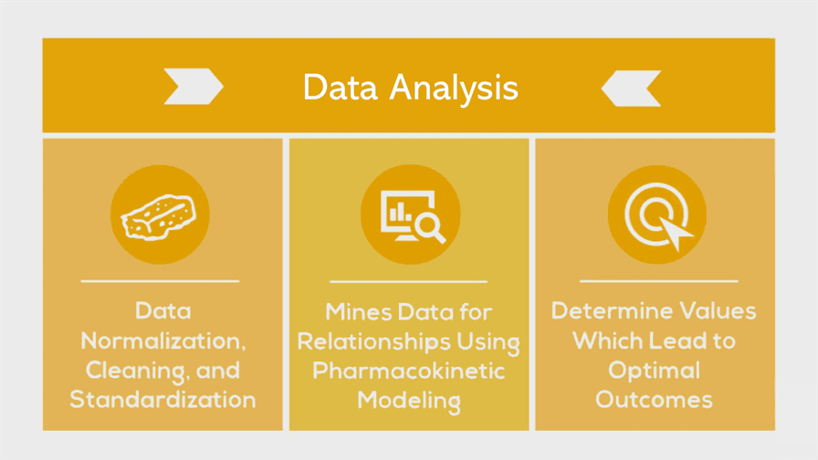

# 📈 Data Analysis

The Analytics Engine performs temporal precedence accounting, longitudinal data aggregation, erroneous data filtering, unit conversions, ingredient tagging, and variable grouping to quantify correlations between symptoms, treatments, and other factors.

It then pairs every combination of variables and identifies likely causal relationships using correlation mining algorithms in conjunction with a pharmacokinetic model.  The algorithms first identify the onset delay and duration of action for each hypothetical factor. It then identifies the optimal daily values for each factor.

# Determining Treatment Effects from Sparse and Irregular Time Series Data

## Introduction

Analyzing the effects of a treatment based on observational time series data is a common need in many domains like medicine, psychology, and economics. However, this analysis often faces several key challenges:

- The data is **sparse** - there are limited number of observations.
- The data is **irregular** - observations are not at regular time intervals.
- There is **missing data** - many timepoints have no observation.
- The **onset delay** of the treatment effect is unknown. It may take time to appear.
- The **duration** of the treatment effect is unknown. It may persist after cessation.
- Both **acute** (short-term) and **cumulative** (long-term) effects need to be analyzed.
- **Causality** and **statistical significance** need to be established rigorously.
- The **optimal dosage** needs to be determined to maximize benefits.

This article provides a comprehensive methodology to overcome these challenges and determine whether a treatment makes an outcome metric better, worse, or has no effect based on sparse, irregular time series data with missingness.

## Data Preprocessing

Before statistical analysis can begin, the data must be preprocessed:

- **Resample** the time series to a regular interval if needed while preserving original timestamps. This allows handling missing data. For example, resample to 1 measurement per day.
- **Do not** do interpolation or forward fill to estimate missing values. This introduces incorrect data. Simply exclude those time periods from analysis.
- **Filter out** any irrelevant variances like daily/weekly cycles. For example, detrend the data.

Proper preprocessing sets up the data for robust analysis.

## Statistical Analysis Methodology

With cleaned data, a rigorous methodology can determine treatment effects:

### Segment Data
First, split the data into three segments:

- **Pre-treatment** - Period before treatment began
- **During treatment** - Period during which treatment was actively administered
- **Post-treatment** - Period after treatment ended

This enables separate analysis of the acute and cumulative effects.

### Acute Effects Analysis

To analyze **acute** effects, compare the 'during treatment' segment vs the 'pre-treatment' segment:

- Use interrupted time series analysis models to determine causality.
- Apply statistical tests like t-tests to determine significance.
- Systematically test different onset delays by shifting the 'during treatment' segment start time back incrementally. Account for unknown onset.
- Systematically test excluding various amounts of time after treatment cessation to account for effect duration.
- Look for acute improvements or decrements right after treatment begins based on the models.

### Cumulative Effects Analysis

To analyze **cumulative** effects, build regression models between the outcome variable and the cumulative treatment dosage over time:

- Use linear regression, enforcing causality constraints.
- Apply statistical tests like F-tests for significance.
- Systematically test excluding various amounts of time after treatment cessation to account for effect duration.
- Look for long-term improvements or decrements over time based on the regression models.

### Overall Effect Determination

Combine the acute and cumulative insights to determine the overall effect direction and statistical significance.

For example, acute worsening but long-term cumulative improvement would imply an initial side effect but long-term benefits. Lack of statistical significance would imply no effect.

### Optimization

To determine the **optimal dosage**, incrementally adjust the daily dosage amount in the models above. Determine the dosage that minimizes the outcome variable in both the acute and cumulative sense.

## Analysis Pipeline

Absolutely, given your constraints and requirements, here's a refined methodology:

1. **Data Preprocessing**:
  - **Handling Missingness**: Exclude rows or time periods with missing data. This ensures the analysis is grounded in actual observations.
  - **Standardization**: For treatments with larger scales, standardize values to have a mean of 0 and a standard deviation of 1. This will make regression coefficients more interpretable, representing changes in symptom severity per standard deviation change in treatment.

2. **Lagged Regression Analysis**:
  - Evaluate if treatment on previous days affects today's outcome, given the discrete nature of treatment.
  - Examine up to a certain number of lags (e.g., 30 days) to determine potential onset delay and duration.
  - Coefficients represent the change in symptom severity due to a one unit or one standard deviation change in treatment, depending on whether standardization was applied. P-values indicate significance.

3. **Reverse Causality Check**:
  - Assess if symptom severity on previous days predicts treatment intake. This helps in understanding potential feedback mechanisms.

4. **Cross-UserVariableRelationship Analysis**:
  - Analyze the correlation between treatment and symptom severity across various lags.
  - This aids in understanding potential onset delays and durations of effect.

5. **Granger Causality Tests**:
  - Test if past values of treatment provide information about future values of symptom severity and vice-versa.
  - This test can help in determining the direction of influence.

6. **Moving Window Analysis** (for cumulative effects):
  - Create aggregated variables representing the sum or average treatment intake over windows (e.g., 7 days, 14 days) leading up to each observation.
  - Use these in regression models to assess if cumulative intake over time affects symptom severity.

7. **Optimal Dosage Analysis**:
  - Group data by discrete dosage levels.
  - Calculate the mean symptom severity for each group.
  - The dosage associated with the lowest mean symptom severity suggests the optimal intake level.

8. **Control for Confounders** (if data is available):
  - If data on potential confounding variables is available, incorporate them in the regression models. This helps in isolating the unique effect of the treatment.

9. **Model Diagnostics**:
  - After regression, check residuals for normality, autocorrelation, and other potential issues to validate the model.

10. **Interpretation**:
  - Consistency in findings across multiple analyses strengthens the case for a relationship.
  - While no single test confirms causality, evidence from multiple methods can offer a compelling case.

By adhering to this methodology, you will be working with actual observations, minimizing the introduction of potential errors from imputation. The combination of lagged regression, Granger causality tests, and moving window analysis will provide insights into both acute and cumulative effects, onset delays, and optimal treatment dosages.

## Conclusion

This rigorous methodology uses interrupted time series analysis, regression modeling, statistical testing, onset/duration modeling, and optimization to determine treatment effects from sparse, irregular observational data with missingness. It establishes causality and significance in both an acute and cumulative sense. By finding the optimal dosage, it provides actionable insights for maximizing the benefits of the treatment.

