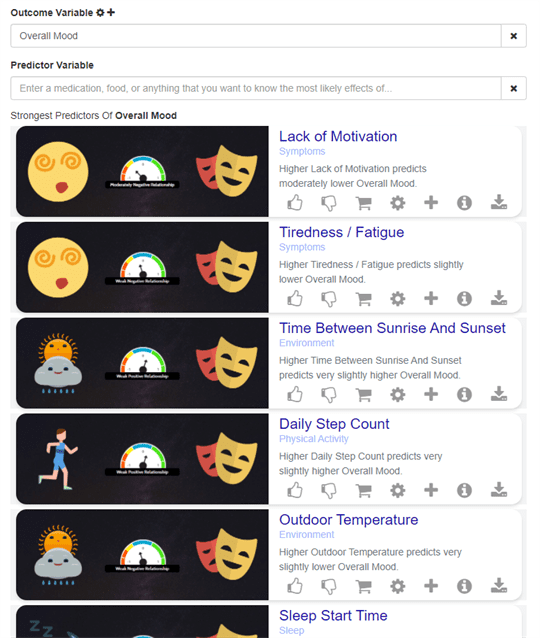

# 🔎 Predictor Search Engine Plugin

Aggregated user data is used to determine the factors that most influence any given aspect of health, powering the QM Search Engine.

Anyone wanting to optimize any quantifiable aspect of their life is able to search and see a list of the products that are most effective at helping the average user achieve a particular health and wellness goal. For instance, if one wishes to improve one’s sleep efficiency, go to our site and search for “sleep efficiency”, where one is able to select from the list of products that most affect sleep efficiency.

Impact: Clinicians and those suffering from chronic conditions will have access to the personalized effectiveness rates of treatments and the percent likelihood of root causes.

The search engine is available in a variety of layout settings.

### Network Graph Style

[Network Graph Demo](https://app.quantimo.do/variables/Overall%20Mood)

### Embeddable Cards

### Embeddable Simple List

### Study Cards in Ionic App

[Study Cards in Ionic App Demo](https://web.quantimo.do/dev/src/ionic/src/index.html#/app/predictors/Overall%20Mood)

### Nutrition Facts Style

[Nutrition Facts Style Demo](https://app.quantimo.do/variables/Overall%20Mood)

### Bar Chart Style

[Bar Chart Demo](https://app.quantimo.do/variables/Overall%20Mood)

### Sankey Chart Style

[Sankey Chart Demo](https://app.quantimo.do/variables/Overall%20Mood)

