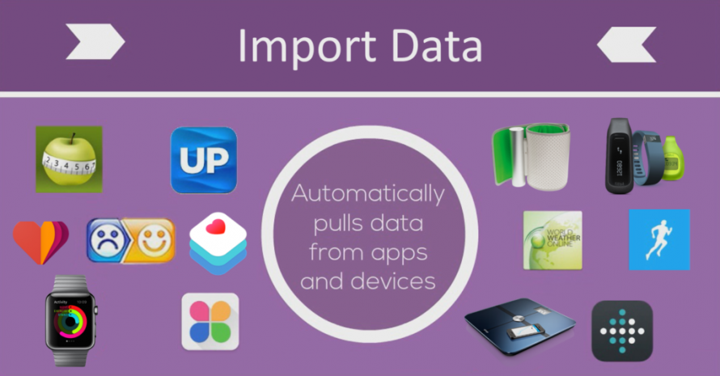

# 🕸 mHealth Data Import

Import data from fitness trackers, wearables, health apps, and more.

One of the most significant features of this integration tool is its automation capability, which enables regular data collection and import from connected sources. With this feature, users can rest assured that their data is up-to-date and accurate.

Overall, this data import integration tool is a powerful solution for anyone seeking to manage their health and wellness data. Its versatility, automation, and customization capabilities make it a valuable tool for individuals looking to gain insights into their health and wellness.

## Related Code
