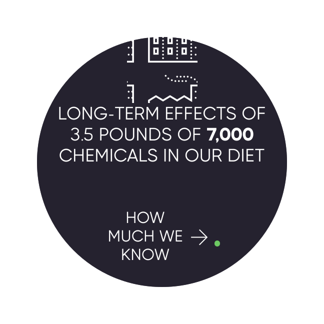
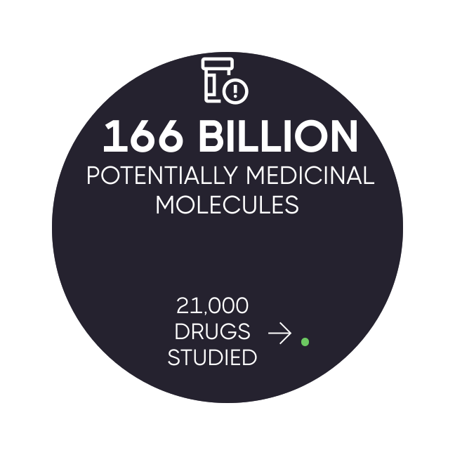
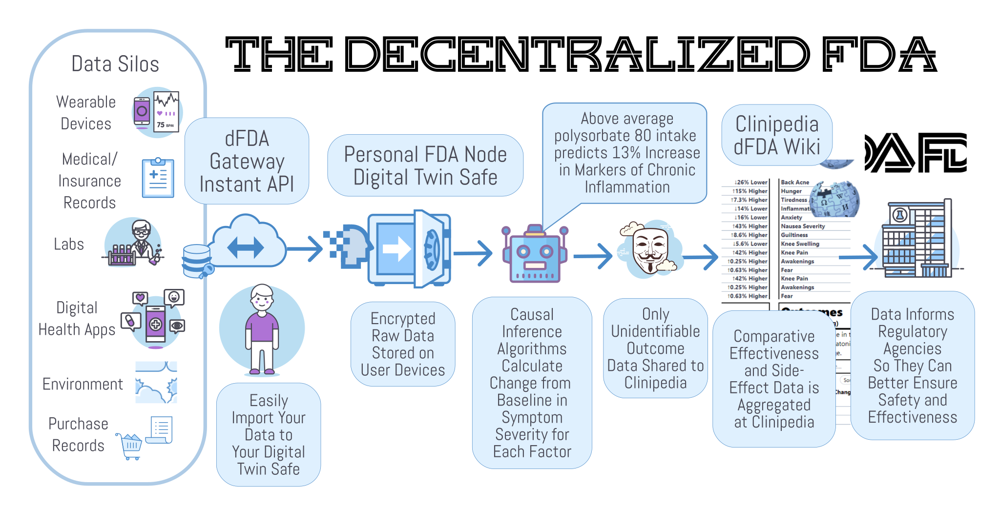
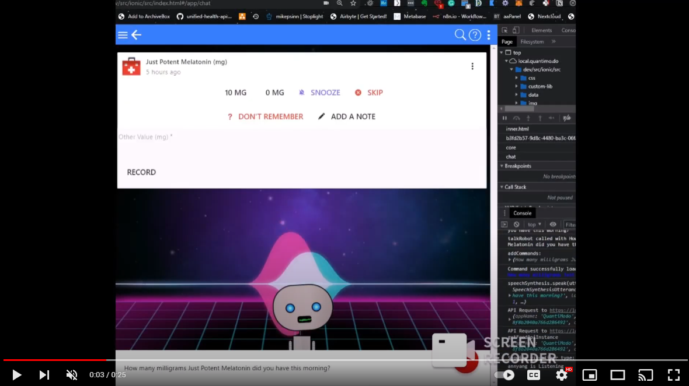

> 🚧 **WORK IN PROGRESS!** 🚧   
>Contributions are eternally appreciated!   
>It's our goal to avoid any duplication of effort. So please include existing projects that would be interested in fulfilling any part of this global framework.   
> 
> 📢 **Call for Grant Applications**   
> Crowdsourcing Cures is currently accepting grant applications from individuals or organizations interested in contributing to this project. Please apply by sending your proposal to [hello@crowdsourcingcures.org](mailto:hello@crowdsourcingcures.org)
by December 1st.  

# 😕 Why the hell are we doing this?

The current system of clinical research, diagnosis, and treatment is miserably failing the billions of people are suffering from chronic diseases.

  
👉 Click to learn more about why it sucks... 

It takes over [10 years and 2.6 billion dollars](https://www.semanticscholar.org/paper/Innovation-in-the-pharmaceutical-industry%3A-New-of-DiMasiGrabowski/3275f31c072ac11c6ca7a5260bd535720f07df41) to bring a drug to market (including failed attempts).
It costs [$41k](https://www.clinicalleader.com/doc/getting-a-handle-on-clinical-trial-costs-0001) per subject in Phase III clinical trials.

The high costs lead to:

⚛️ **1. No Data on Unpatentable Molecules**

We still know next to nothing about the long-term effects of 99.9% of the 4 pounds of over [7,000](https://www.dailymail.co.uk/health/article-8757191/Are-additives-food-making-ill.html) different synthetic or natural compounds. This is because there's only sufficient incentive to research patentable molecules.

🤑 **2. Lack of Incentive to Discover Every Application of Off-Patent Treatments**

Thousands of drugs were found to work for other diseases after the patent expired. Unfortunately, there isn't financial incentive to do any more research on them at this point.

📆 **3. No Long-Term Outcome Data**

It's not financially feasible to collect a participant's data for years or decades. Thus, we don't know if the long-term effects of a drug are worse than the initial benefits.

🤐 **4. Negative Results Aren't Published**

Pharmaceutical companies tend to only report "positive" results. That leads to other companies wasting money repeating research on the same dead ends.

🎯 **5. Trials Exclude a Vast Majority of The Population**

One investigation found that only [14.5%](https://www.ncbi.nlm.nih.gov/pubmed/14628985) of patients with major depressive disorder fulfilled eligibility requirements for enrollment in an antidepressant trial. Furthermore, most patient sample sizes are very small and sometimes include only 20 people.

🤏 **6. We Only Know 0.000000002% of What is Left to be Researched**

We've only studied [0.000000002%](https://www.centerwatch.com/articles/12702-new-mit-study-puts-clinical-research-success-rate-at-14-percent) of the [166 billion](https://www.nature.com/articles/549445a) potential medicinal molecules.

# 🧪 Our Hypothesis

By harnessing global collective intelligence and oceans of real-world data we hope to generate discoveries 50X faster and 1000X cheaper than current systems.

  
👉 Click to learn more about what's possible...

So in the 90's, Microsoft spent billions hiring thousands of PhDs to create Encarta, the greatest encyclopedia in history.  A decade later, when Wikipedia was created, the general consensus was that it was going to be a dumpster fire of lies.  Surprisingly, Wikipedia ended up generating information 50X faster than Encarta and was about 1000X cheaper without any loss in accuracy.  This is the magical power of crowdsourcing and open collaboration.

Our crazy theory is that we can accomplish the same great feat in the realm of clinical research.  By crowdsourcing real-world data and observations from patients, clinicians, and researchers, we hope the Decentralized FDA could also generate clinical discoveries 50X faster and 1000X cheaper than current systems.

## The Potential of Real-World Evidence-Based Studies

- **Diagnostics** - Data mining and analysis to identify causes of illness
- **Preventative medicine** - Predictive analytics and data analysis of genetic, lifestyle, and social circumstances
  to prevent disease
- **Precision medicine** - Leveraging aggregate data to drive hyper-personalized care
- **Medical research** - Data-driven medical and pharmacological research to cure disease and discover new treatments and medicines
- **Reduction of adverse medication events** - Harnessing of big data to spot medication errors and flag potential
  adverse reactions
- **Cost reduction** - Identification of value that drives better patient outcomes for long-term savings
- **Population health** - Monitor big data to identify disease trends and health strategies based on demographics,
  geography, and socioeconomic

# 🖥️ Technical Architecture

This is a very high-level overview of the architecture.  It's a work in progress.  Please contribute!

## 🚧 Initial Prototype

We've implemented an initial monolithic prototype of this architecture in [apps/dfda-1](../apps/dfda-1). It would better be described as a Centralized Decentralized FDA.  However, our goal is to a new, decentralized, simplified, modular, version of this broken into the components below.

We don't want to reinvent the wheel in any way, so if there's an existing project that fulfills the requirements of a component, please [let us know](https://github.com/decentralized-fda/decentralized-fda/discussions) or contribute!

## 1. Data Silo API Gateway Nodes

dFDA Gateway API Nodes make it easy for data silos, such as hospitals and digital health apps, to let people export and save their data locally in their [PersonalFDA Nodes](#2-personalfda-nodes).

### Tentative Requirements
   - OAuth2 Protected API
   - Personal Access Token Management
   - Developer Portal
   - OpenAPI Documentation
   - Software Development Kits (SDKs)
   - Data Encryption
   - HIPAA and GDPR Compliance
   - Multiple Data Format Options
   - Data Structure Options

**👉[Learn More](components/data-silo-api-gateways.md)**

## 2. PersonalFDA Nodes

PersonalFDA Nodes are applications that can run on your phone or computer. They import, store, and analyze your data to identify how various factors affect your health.  They can also be used to share anonymous analytical results with the [Clinipedia dFDA Wiki](#3-clinipediathe-wikipedia-of-clinical-research) in a secure and privacy-preserving manner.

PersonalFDA Nodes are composed of two components, a Digital Twin Safe and an AI agent called Optimitron (or some better name) that uses causal inference to estimate how various factors affect your health.

### 2.1. Digital Twin Safe

A local application for self-sovereign import and storage of personal data.

#### Requirements
   - [Data Import](components/mhealth-data-import/mhealth-data-import.md)
   - Quantum-Resistant Data Encryption
   - Sync Data Between Trusted Devices
   - Multifactorial and Biometric Security
   - Data Sharing Controls

**👉[Learn More or Contribute to Digital Twin Safe](components/digital-twin-safe.md)**

### 2.2. Optimitron AI Agent

Optimitron is an AI agent that lives in your PersonalFDA node that uses causal inference to estimate how various factors affect your health.

Optimitron is an AI assistant that asks you about your symptoms and potential factors. Then she applies pharmacokinetic predictive analysis to inform you of the most important things you can do to minimize symptom severity.

[Or Try the Prototype Here](https://demo.curedao.org/app/public/#/app/chat)

#### Data Analysis

Currently, we've implemented causal inference analysis of sparse time series data that takes into account onset delays and other factors.

We're working on implementing a more robust pharmacokinetic predictive model control recurrent neural network.

Ideally, Optimitron AI agent will be able to further improve the precision and accuracy of the real-time recommendations over time by leveraging reinforcement learning and community contributions.

## 3. Clinipedia—The Wikipedia of Clinical Research

The Clinipedia wiki should be a global knowledge repository containing the aggregate of all available data on the effects of every food, drug, supplement, and medical intervention on human health.

### Tentative Requirements
   - Editing Authorization and Conflict Resolution Mechanisms
   - AI Agent Generated Meta-Analyses Combining All Existing Research on Each Intervention/Outcome Pair
   - Directory of Data Silos and Instructions for Individuals to Export Their Data to their Digital Twin Safes
   - Inter-Jurisdictional Comparative Policy Analysis of the Outcomes of Regulatory Decisions
   - Outcome Labels List the Degree to Which the Product is Likely to Improve or Worsen Specific Health Outcomes or Symptoms
   - Certification of Intervention Manufacturers/Sources
   - Intervention Effectiveness Ranking for Specific Outcomes or Conditions
   - Decentralized Clinical Trial Coordination and Protocols

**[👉 Learn More or Contribute to the Clinipedia](components/clinipedia.md)**

# AI Collective Intelligence Platform

A collective intelligence coordination platform is needed for facilitating cooperation, communication, and collaborative actions among contributors.

## Desired Features

1. Communication Channels
2. Resource Sharing Mechanisms
3. Decentralized Collaborative Workspaces
4. Partnership Agreements
5. Project Management
6. Knowledge Repository
7. Legal and Regulatory Guidance
8. Impact Tracking
9. Reputation Scoring

**[👉 Learn More or Contribute to the dFDA Collaboration Framework](components/dfda-collaboration-framework.md)**

# To-Do List

1. Establish Foundation
2. Build Board of Directors
3. Establish Collaborations and Partnerships
4. Data Silo Gateway API Nodes
5. PersonalFDA Nodes
6. Clinipedia dFDA Wiki

**[👉 Click Here for a Detailed Roadmap and Milestones](roadmap.md)**

