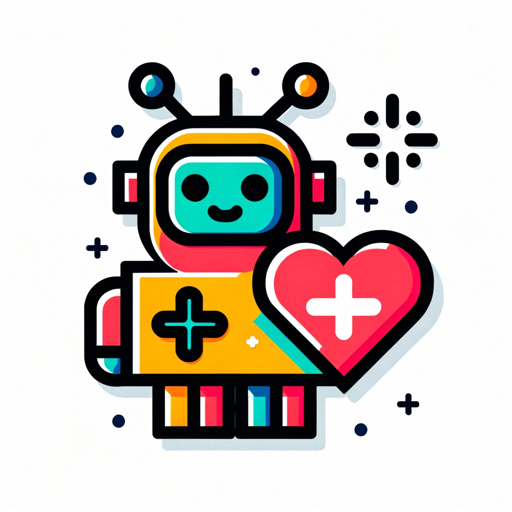

# Autonomous Non-Profit Designer

A custom GPT that guides non-profits to develop data-driven autonomous agents that maximize positive impact.

**Help and feedback are always welcome!**

## References:
* [What is a GPT?](https://openai.com/blog/introducing-gpts)
* [GPT Actions](https://platform.openai.com/docs/actions)

## Demo

https://chat.openai.com/g/g-71pbMpbpE-positron-autonomous-nonprofit-designer
