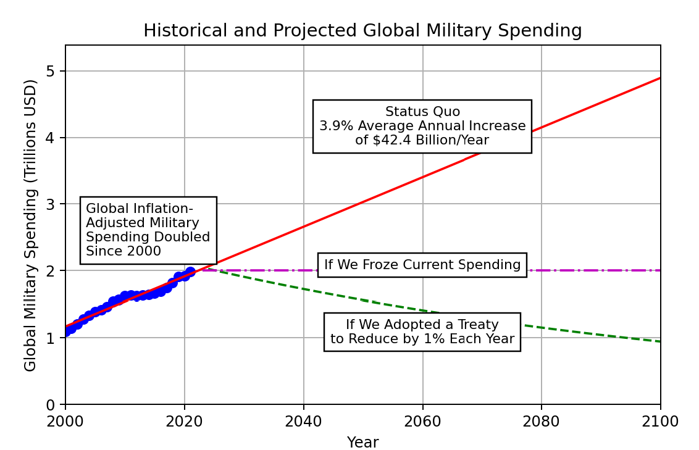

# Why Current Military Spending is Excessive

If you simply consider one part of military spending, nuclear weapons, we already have 13,000 nuclear weapons. This is enough to cause between 13 and 130 "extinction-level events" if you account for the effects of nuclear winter.  

Even if you believe some level of military spending is warranted, we certainly don't need to be able to exterminate the human race more than once.

Yet, we keep increasing military spending by $42 billion dollars a year.

## Calculations

Given the rough estimate that 100 to 1,000 nuclear detonations could potentially trigger a nuclear winter sufficient to cause global agricultural collapse and widespread famine, potentially endangering the majority of the world's population, the concept of "extinction-level events" becomes more nuanced when considering the long-term environmental impact rather than direct fatalities alone.

If we work with the assumption from earlier calculations that the entire global nuclear arsenal (approximately 13,000 warheads) has the "theoretical kill capability" to exterminate the world's population approximately 1.625 times based solely on direct impacts, incorporating the effects of nuclear winter complicates the picture:

- **Direct Impact**: Without considering nuclear winter, 13,000 warheads could theoretically kill the global population 1.625 times.
- **Nuclear Winter Impact**: If 100 to 1,000 warheads are sufficient to trigger a catastrophic nuclear winter potentially leading to the majority of the global population's demise, then the arsenal could cause the conditions for global catastrophe many times over.

### Theoretical Extinction-Level Events Calculation

- **Lower Bound (100 warheads/event)**: With 13,000 warheads, you could have 130 "events" where each event is defined as a scenario sufficient to potentially trigger a nuclear winter.
- **Upper Bound (1,000 warheads/event)**: With 13,000 warheads, you could have 13 "events," where each event represents a larger scale scenario sufficient to potentially trigger a nuclear winter.

Based on the assumption that between 100 and 1,000 warheads could cause catastrophic global climate effects leading to widespread famine and societal collapse, the global nuclear arsenal could theoretically cause between 13 and 130 "extinction-level events." This calculation frames the concept of "extinction-level events" in terms of potential to trigger widespread ecological and societal collapse, rather than direct fatalities alone.

## The Existential Threat of the AI Arms Race

In an era where artificial intelligence (AI) advancements hold the potential to redefine warfare, humanity faces an unprecedented existential challenge. The prospect of an AI arms race, with nations vying for supremacy in military AI technologies, poses threats far beyond traditional conflicts, edging us closer to potential catastrophe. The 1% Treaty, proposing that countries allocate just 1% of their military budgets towards AI safety and ethical research, stands as a crucial initiative to counteract these dangers, fostering a collaborative global approach to prevent AI-induced human extinction.

The AI arms race carries inherent risks that are distinct and potentially more perilous than any technological competition humanity has faced:

- **Autonomous Decision-making**: AI systems capable of making lethal decisions without human intervention present an unpredictable threat. Unlike humans, who possess moral judgment and fear of mutual destruction, AI lacks such constraints, potentially leading to unintended escalations.
- **Acceleration and Opaqueness**: The pace at which AI technologies can evolve surpasses traditional arms development, making it difficult for regulatory bodies to keep up. Additionally, the opaque nature of AI algorithms can obscure their decision-making processes, making it challenging to predict or control their actions in conflict scenarios.
- **Cyber and Physical Vulnerabilities**: Military AI applications extend to cyber operations, where AI can exploit vulnerabilities at speeds and with a level of sophistication unattainable by humans. Physical security is equally at risk, with drones and autonomous vehicles opening new fronts in warfare that can be difficult to defend against.
- **Global Instability**: The diffusion of AI technologies means that not only state actors but also non-state actors could acquire capabilities to conduct high-impact operations, potentially destabilizing regions or triggering international conflicts.

## The 1% Treaty's Role in Mitigating Risks

The risks associated with the AI arms race necessitate immediate and unified action to prevent a drift towards catastrophe. The 1% Treaty offers a pragmatic approach to demilitarization, aiming to repurpose a fraction of the world's military expenditures towards ensuring AI benefits humanity rather than leading to its demise. By addressing the multifaceted threats of an AI arms race and fostering an environment of cooperation and safety, the treaty paves the way for a future where technological advancements are synonymous with global security and prosperity. In the face of AI's dual-use nature, the choice to embrace demilitarization and collaborative governance is not just strategic—it's essential for our survival.
