# Return on Investment in Lobbying

Defense companies globally are estimated to spend between $200 million and $300 million annually on lobbying efforts. These investments are directed towards influencing defense policy, securing contracts, and shaping military spending priorities.

#### Government Contracts to Defense Companies

Military contractors globally receive between $800 billion to $1 trillion annually from government contracts. 

```mermaid
graph LR
MIC("🏭 Military-<br>Industrial<br>Complex") -->|"💰 Pays<br>Lobbyists<br>$200M"| L("🤝 Lobbyists")
L -->|"📈 Influence"| G("🏛 Government")
G -->|"💸 $1T +<br>$42B/4% increase<br>every year<br>for nuclear &<br>autonomous weapons<br>systems, etc."| MIC
style MIC fill:#fff,stroke:#333,stroke-width:4px,color:#000
style L fill:#fff,stroke:#333,stroke-width:2px,color:#000
style G fill:#fff,stroke:#333,stroke-width:2px,color:#000
```

#### Calculating the ROI

The return on investment (ROI) for lobbying efforts is calculated using the formula: 

ROI = ( Benefit − Cost ) / Cost × 100

Applying this formula:

- **Lower Estimate**: With a lobbying cost of $200 million and benefits of $800 billion from contracts, the ROI calculates to approximately 399,900%.
- **Higher Estimate**: With a lobbying cost of $300 million and benefits of $1 trillion, the ROI is approximately 333,233.33%.
