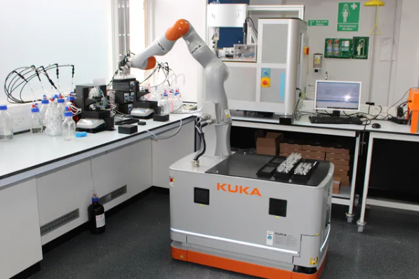
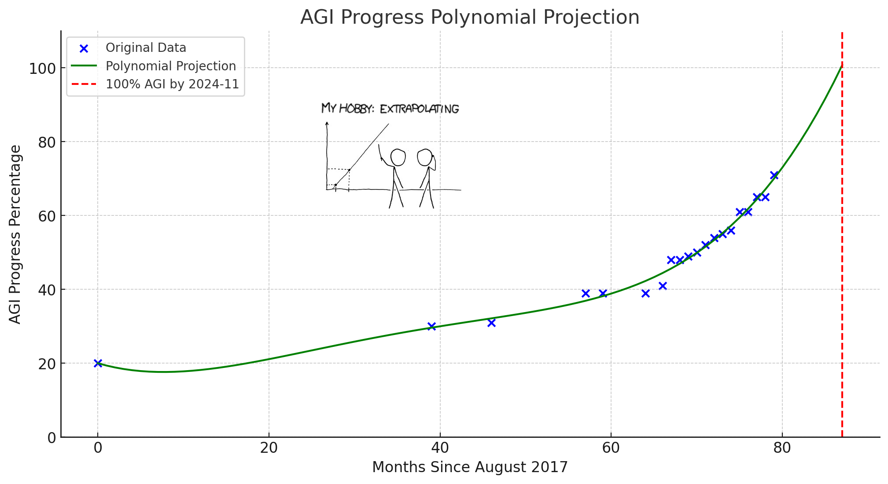
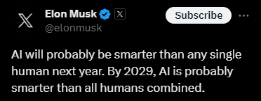
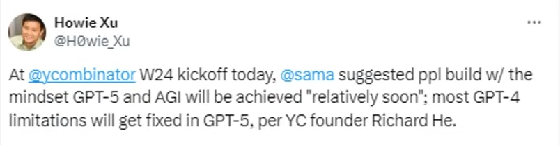

# Increased Efficiency of Automating Clinical Discovery

Based on the rate of recent advancements, we may achieve artificial general intelligence (AGI) by November 2024. AGI means AI that can complete any cognitive task as well or better than any living human.

This timeline has been supported by both Sam Altman, CEO of OpenAI, and Elon Musk who believes that AI will be smarter than any human by the end of 2024 and smarter than all combined humans by 2029.

Based on the following estimate, it appears that AGI will eventually be able to make 260 years of scientific progress every single year.

To estimate the increased efficiency of AGI AI scientists compared to human scientists, we need to consider several factors. Let's break it down:

## 1. Working hours:

- Human scientists typically work 40 hours per week, with time off for weekends, holidays, and vacations. Assuming 50 working weeks per year, that's around 2,000 hours per year.
- AGI AI scientists could potentially work 24/7/365, which equates to 8,760 hours per year.
- Efficiency gain: 8,760 / 2,000 = 4.38 times more working hours.

## 2. Knowledge sharing and access:

- Human scientists often work in silos, with limited real-time access to the knowledge and insights of their peers. They rely on published papers, conferences, and personal networks to stay informed.
- AGI AI scientists could have instant, comprehensive access to the knowledge and experiences of all other AI scientists, allowing them to build on each other's work seamlessly.
- Efficiency gain: Estimating conservatively, let's say this instant knowledge sharing doubles the effective output per working hour.

## 3. Eliminating redundant work:

- Human scientists often duplicate efforts by exploring the same dead ends, as failed experiments are rarely published.
- AGI AI scientists could share all experimental results, including failures, allowing them to collectively learn and avoid redundant work.
- Efficiency gain: Let's conservatively estimate that eliminating redundant work could increase effective output by another 50%.

## 4. Cognitive efficiency:

- Human scientists are subject to cognitive limitations, biases, and distractions that can impede their problem-solving efficiency.
- AGI AI scientists could potentially operate at peak cognitive performance consistently, optimizing their thought processes for maximum insight and productivity.
- Efficiency gain: Assuming AGI AI scientists are twice as cognitively efficient as humans on average.

## 5. Experimental iteration speed:

- Human scientists are limited by physical constraints in how quickly they can set up, run, and analyze experiments.
- AGI AI scientists could potentially run simulated experiments and analyze data at a much faster pace, allowing for more rapid iteration and learning.
- Efficiency gain: Estimating that AGI AI scientists could iterate on experiments 10 times faster than human scientists.

## Putting it all together:

- Baseline human scientist annual output: 1
- AGI AI scientist annual output:
  - Working hours: 1 * 4.38 = 4.38
  - Knowledge sharing: 4.38 * 2 = 8.76
  - Eliminating redundancy: 8.76 * 1.5 = 13.14
  - Cognitive efficiency: 13.14 * 2 = 26.28
  - Experimental iteration: 26.28 * 10 = 262.8

Therefore, based on these assumptions and estimates, an AGI AI scientist could potentially be around 260 times more productive than a human scientist.

# Examples

The integration of Artificial Intelligence (AI) in drug discovery and development is reshaping the pharmaceutical industry, offering unprecedented speed and efficiency in bringing new treatments to market. Here are some of the trailblazing companies that are at the forefront of this revolution.

## Insilico Medicine: Pioneering AI-Driven Drug Discovery

Insilico Medicine has made significant strides with its Pharma.AI platform, which employs deep learning algorithms to discover new drug targets and generate novel drug candidates. In a remarkable feat, the company designed, synthesized, and validated a drug candidate for idiopathic pulmonary fibrosis in a mere 46 days. Their collaborations with pharmaceutical companies span across various therapeutic areas, including cancer and infectious diseases, showcasing the versatility of their AI tools.

## DeepMind: Unraveling Protein Structures with AlphaFold

DeepMind's AlphaFold AI system has revolutionized structural biology by accurately predicting the 3D structures of proteins from their amino acid sequences. This breakthrough came to light during the CASP14 protein structure prediction challenge in 2020, where AlphaFold demonstrated its potential to transform drug discovery.

## Exscientia: Streamlining Drug Design with AI

Exscientia leverages AI algorithms to design and optimize small molecule drugs for a range of diseases, including oncology and immunology. Their collaboration with Sumitomo Dainippon Pharma led to the development of a novel drug for obsessive-compulsive disorder, which entered clinical trials just 12 months after target selection, exemplifying AI's ability to expedite the preclinical phase.

## Recursion Pharmaceuticals: High-Throughput Cellular Imaging Analysis

Recursion Pharmaceuticals employs AI and automation to analyze vast cellular imaging data, identifying potential drug candidates for various diseases. In 2020, they partnered with Bayer to develop treatments for fibrotic diseases using their AI-driven platform.

## BenevolentAI: Mining Biomedical Data for Drug Discovery

BenevolentAI harnesses AI to sift through extensive biomedical data, including scientific literature and clinical trial results, to uncover novel drug targets and formulate new treatment hypotheses. Their AI platform identified baricitinib as a potential COVID-19 treatment, which was fast-tracked into clinical trials and received FDA emergency use authorization.

## Moderna Therapeutics: Rapid Vaccine Development with AI Integration

Moderna Therapeutics stands out for its swift response to the COVID-19 pandemic, using AI to develop an mRNA-based vaccine in just a few days and bringing it to market within a year.

# Future House

[Future House](https://www.futurehouse.org/) is 10-year mission is to build semi-autonomous AIs that can scale scientific research, to accelerate the pace of discovery and to provide world-wide access to cutting-edge scientific, medical, and engineering expertise.

## Additional AI Innovations in Drug Discovery

- Insilico Medicine's small molecule inhibitor for Idiopathic Pulmonary Fibrosis, designed in 18 months, is now in Phase I trials.
- Exscientia's AI-designed molecule for immuno-oncology entered human clinical trials within eight months.
- BenevolentAI's Knowledge Graph facilitated the rapid identification of an effective COVID-19 antiviral.
- DeepMind's AlphaFold continues to aid in understanding disease mechanisms and designing targeted therapies.

In a trial reported in Nature, an AI lab assistant was able to perform experiments [1,000 times](https://www.theverge.com/21317052/mobile-autonomous-robot-lab-assistant-research-speed) faster than a human lab assistant.

## Conclusion

AI is dramatically accelerating the pace of clinical research. These companies exemplify how AI can reduce the time and cost of drug development, from identifying targets to clinical trials, ultimately leading to faster delivery of new treatments to patients in need. As AI technology continues to advance, we can expect even more groundbreaking achievements in the field of drug discovery.
